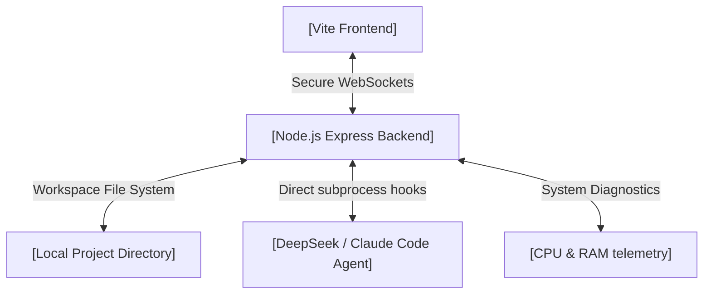

# 🌌 MARSIL AI — Sleek Desktop Coding & Quant Assistant

MARSIL AI is an enterprise-grade, high-comfort desktop coding companion and quantitative trading assistant. Built for maximum developer productivity, it merges a spacious, widescreen GitHub-style user experience with smart dynamic AI reasoning, real-time workspace telemetries, and secure local terminal simulation.

Moving completely away from complex sci-fi overlays, MARSIL AI features a **sleek, high-legibility layout** designed to minimize distraction, enhance dialogues, and let you write code and execute strategies at lightning speed.

---

## ✨ Key Features & New Identity

| Feature | Description | Sleek UI Implementation |
| :--- | :--- | :--- |
| **Widescreen Dev Comfort** | Claims massive empty margin space with a compact Top Bar and custom sidebar column widths (`430px`) for optimal dialogue legibility. | High-comfort slate translucent workspace panels. |
| **Dynamic Bilingual Dialogue** | Seamlessly default to English interface text, while auto-detecting Arabic input to respond with beautifully rendered, disconnected-proof HSL Cairo typography. | Auto-switch direction, `Cairo` font integration. |
| **Instant Pausing & Abort** | A glowing red pausing/abort option when active, turning the submit button into an instant command cancelation. | Glow-pulse warning status light + Abort hook. |
| **Workspace Copy Thread** | One-click button above the dialog box to copy the entire conversation thread history instantly to your clipboard. | Compact inline `<Copy />` clipboard interface. |
| **System Engine HUD** | Live rolling CPU and Memory sparkline charts embedded inside a compact connection status bar. | Mini-sparkline hover tooltips and latency telemetry. |
| **Integrated IDE Panel** | Navigate files with high-readability folder nodes, filter code, and edit in-app with custom font-scale selections. | Clear file tree list items (`0.85rem` sizing). |

---

## 🛠️ Architecture Overview



---

## 🚀 Getting Started

### Prerequisites
- **Node.js** (v18 or higher recommended)
- A **DeepSeek API Key** or local **Claude Code** installed.

### Standard Native Start (100% Safe)
To initialize the servers and install all dependencies:
```bash
# Install root, frontend, and backend packages concurrently
npm run install-all

# Launch both frontend and backend dev servers
npm start
```
*Standard terminal commands bypass Windows SmartScreen/Defender notifications and are 100% safe on all environments.*

### Quick-Start Scripts (Windows Only)
- **`start.bat`**: Double-click to automatically install dependencies and run both servers in parallel.
- **`stop.bat`**: Double-click to surgically terminate all running backend and frontend processes.

---

## 🛡️ SmartScreen & Antivirus False Positives

Since MARSIL AI is a local development automation tool that runs local terminal commands, handles background ports, and makes git checkpoints, some antivirus programs or **Windows SmartScreen** may trigger a false positive alert when downloading and running `.bat` scripts directly.

### How to resolve:
1. **Unblock the ZIP**: Right-click the downloaded `.zip` file -> Select **Properties** -> Check the **Unblock** box at the bottom -> Click **Apply** -> Extract the files.
2. **Use Standard Terminal Commands**: Simply run `npm run install-all` followed by `npm start` in your shell of choice. Standard npm terminal scripts do **not** trigger any security flags and run natively.

---

## 🎨 Design Systems & Custom Cairo Styling

Arabic characters rendered in modern web browsers sometimes suffer from disconnecting letter-spacing glitches. MARSIL AI enforces:
```css
:lang(ar), [dir="rtl"] {
  font-family: 'Cairo', 'Tajawal', sans-serif !important;
  letter-spacing: normal !important;
  word-spacing: normal !important;
}
```
This ensures perfect typographic connection, supreme visual flow, and a premium reading layout matching professional quantitative software standards.
